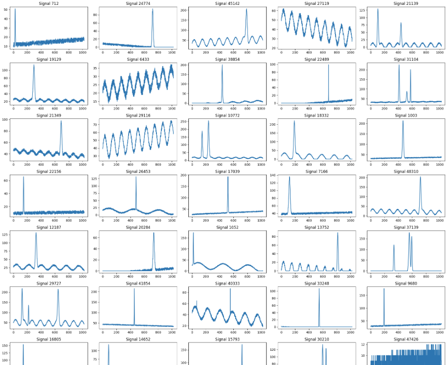

# 🧠 1D Signal Processing — Peak Detection with PyTorch

This repository contains a complete workflow for **1D signal processing** using **deep learning**.\
It includes tools for:
- Loading raw binary signal datasets
- Parsing peak information
- Data augmentation (signal flipping)
- Neural network training and validation
- Loss and metric tracking
- Early stopping and checkpoint saving

---

## 📊 Dataset Example
The dataset consists of one-dimensional signals containing one or more peaks, affected by realistic disturbances such as linear plateaus, sinusoidal patterns, and white noise.\
Below is a sample of raw signals from the dataset (`.raw` format):  

<p align="center">
  
</p>

Each row represents a distinct 1D signal with varying amplitude, noise, and number of peaks.The dataset has been augmented by vertically flipping some signals to increase diversity.

---

## 🧱 Repository Structure

```
1DSignalProcessing/
│
├── dataloader/
│   ├── SignalDataset.py      # Dataset loader and augmentation logic
│
├── networks/
│   ├── SimpleSignalNet.py    # Simple baseline model (MLP)
│   ├── PeakDetectionModel.py # CNN-based peak detector
│
├── trainer/
|   # Training loop, validation, checkpointing, Custom combined loss (BCE + L1) Metrics tracking
│   ├── SignalTrainer.py      
│
├── data/
│   ├── signal.raw            # Binary signal file
│   ├── info.raw              # Metadata describing peaks
│
├── run.py                    # Main script to train and validate
├── requirements.txt          # Dependencies
└── README.md
```

---

## ⚙️ How It Works

1. **Dataset loading**  
   Signals and metadata are read from `.raw` binary files and split into train, validation, and test sets.

2. **Augmentation**  
   Optional *flipping* of signals (`--augment`) doubles the dataset size and improves generalization.

3. **Training**  
   `SignalTrainer` manages the loop with:
   - Custom combined loss (position BCE + height/width L1)
   - Dropout layers for regularization
   - Early stopping and checkpoint saving

4. **Metrics and Logging**  
   Each epoch logs per-component loss (`pos`, `height`, `width`) and overall average.  
   TensorBoard integration will be added soon.

---

## 🚀 Usage

### Train a Model

```bash
python run.py     --signal_path data/signal.raw     --info_path data/info.raw     --chunks 1024     --max_peaks 3     --augment     --batch_size 64     --shuffle     --train_split 0.75     --val_split 0.15
```

### Launch Configuration (VS Code)

```json
"args": [
   "--signal_path", "data/signal.raw",
   "--info_path", "data/info.raw",
   "--chunks", "1024",
   "--max_peaks", "3",
   "--augment",
   "--batch_size", "32",
   "--shuffle",
   "--train_split", "0.75",
   "--val_split", "0.15",
]
```

---

## 🧩 Models

| Model | Type | Description |
|-------|------|--------------|
| `SimpleSignalNet` | MLP | Fast baseline, single-prediction per signal |
| `PeakDetectionModel` | CNN | Learns spatial patterns across time, outputs peak maps and parameters |

---

## 🧮 Custom Loss

The `SignalLoss` combines multiple objectives:
- **BCE Loss** → For peak position detection  
- **L1 Loss** → For peak height and width regression  

\[
\text{Total Loss} = w_{pos} \cdot BCE + w_{height} \cdot L1_{height} + w_{width} \cdot L1_{width}
\]

---

## 📦 Checkpoints

During training, the best model is automatically saved in:

```
networks/checkpoints/best_model_epochX.pth
```

In the same dir, **model.pt** is also saved.
```
networks/checkpoints/model.pt
```

If the directory doesn’t exist, it is created automatically.\


---

## 🧠 Next Steps

- Add TensorBoard integration  
- Implement attention-based architectures  
- Improve data normalization and scaling

---

## 👨‍💻 Author

**Fabio Pasini**  
💡 [GitHub Profile](https://github.com/fabiolapasini)  
📧 fabiola.pasini@hotmail.it

---
